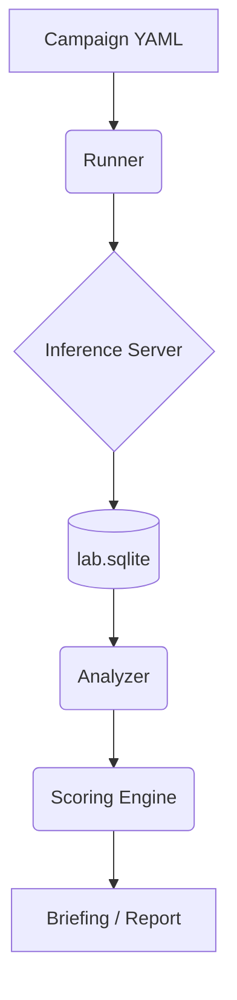

# System Architecture

QuantMap is designed as a **Controlled Benchmarking Pipeline**. It separates the mechanics of execution from the governance of interpretation.

## 1. High-Level Lifecycle

**Data Flow Summary**:
1.  **Definitions**: A **Campaign YAML** defines the sweep (e.g., thread counts).
2.  **Acquisition**: The **Runner** orchestrates the **Inference Server** (llama-server) to generate raw measurements.
3.  **Persistence**: All raw telemetry and request data is stored in **lab.sqlite**.
4.  **Transformation**: The **Analyzer** computes statistics (Normalization), and the **Scoring Engine** applies governance gates.
5.  **Synthesis**: The final **Briefing** provides the human-readable outcome rationale.

## 2. Two-Layer Governance

The core philosophy of QuantMap is "Lock the scale before you weigh the gold."

### Layer A: Metric Registry (`metrics.yaml`)
- The "Rules of Physics."
- Defines units, directionality, and absolute safety floors.
- Decoupled from any specific project or experiment.

### Layer B: Experiment Profile (`profiles/*.yaml`)
- The "Rules of the Game."
- Defines weightings and relative importance.
- Can tighten filters but never relax Registry floors.

## 3. The Analytical Pipeline

### Stage 1: Acquisition (Runner)
- Orchestrates cycles, server startups, and requests.
- Captures raw JSON responses and hardware telemetry.
- Records data to `requests` and `telemetry` tables.

### Stage 2: Normalization (Analyzer)
- Computes statistics (Median, P90, CV) from valid warm samples.
- Handles outlier detection and winsorization.

### Stage 3: Governance (Scoring)
- Applies Elimination Filters (Gates).
- Normalizes metrics using Absolute-Reference Min-Max scaling.
- Computes the champion `composite_score`.

### Stage 4: Synthesis (Explainability)
- Heuristic briefing engine.
- Contrasts winner vs runner-up.
- Projects operational constraints (Thermals, Stability).

## 4. Key Design Patterns

- **Stateless Interpretation**: Scoring logic does not modify raw data; it derives a "Score Layer" in the database.
- **Forensic Determinism**: Identical raw data always produces identical briefings, regardless of when or where the analysis is run.
- **Fail-Fast Readiness**: The `doctor` layer prevents the acquisition of "garbage data" by validating the environment before execution.
